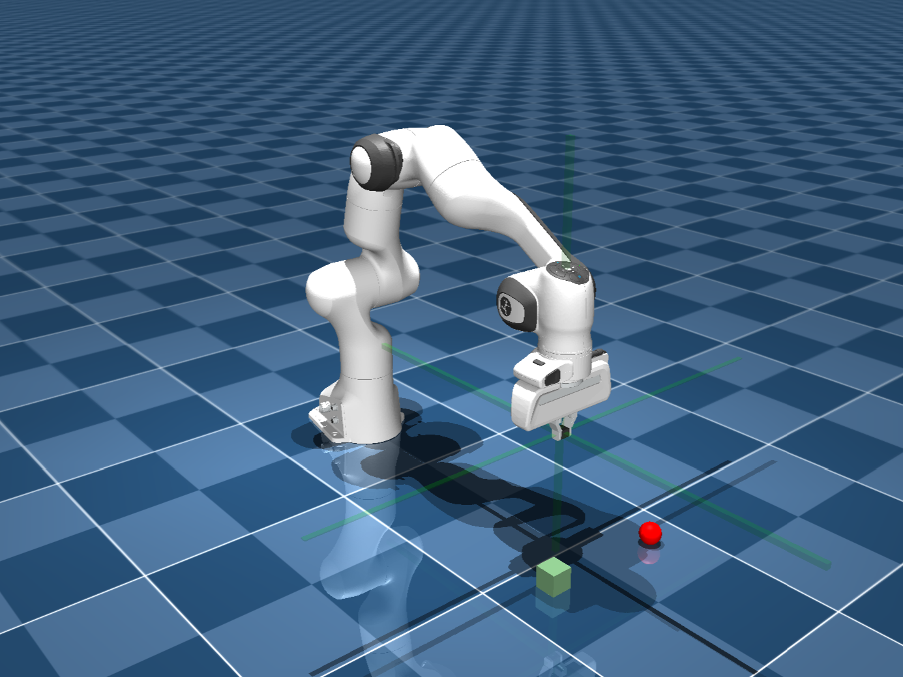

# Autonomous Motion Planning for a Robotic Arm

ME5418 Project of NUS Mechanical Engineering MSc

This repository is inspired by [panda-gym](https://github.com/qgallouedec/panda-gym.git) and developed with the Franka Emika Panda arm in [MuJoCo](https://github.com/google-deepmind/mujoco_menagerie).

## Start training

run the 'franka_training.ipynb'

After running, it will output the neural network structure, input and output details, visualization interfaces, and training logs. The trained model will be saved as a zip file, and training metrics will be logged to TensorBoard. Each algorithm is trained for only 200 timesteps as a demonstration.

## Test the trained model

run the 'franka_test.ipynb'

After running, it will first display the performance of a conventional control method, followed by outputting the trained model's performance in visualization interfaces and plotting the success rate. Each test is conducted for 10 rounds.

For the push task, the model was trained for 500000 timesteps.

For the pick task, the model was trained for 1000000 timesteps.

